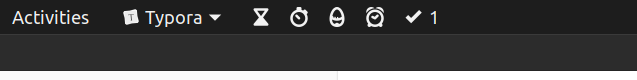

```python
from sklearn.naive_bayes import GaussianNB
gnb = GaussianNB()
```

# Outliers

# Sampling

## Over Sampling


```python
from imblearn.over_sampling import RandomOverSampler

oversample = RandomOverSampler(sampling_strategy='minority')
X_over, y_over = oversample.fit_resample(X, y)
```

## Under Sampling


```python
from imblearn.under_sampling import RandomUnderSampler

undersample = RandomUnderSampler(sampling_strategy='majority')
X_under, y_under = undersample.fit_resample(X, y)
```


# Theory

https://onedrive.live.com/redir?resid=4EC15AA462FC0FE4%212087&page=Edit&wd=target%28Naive%20Bayes.one%7C3656f66a-2e75-4aca-a452-4a8c18626633%2FIMPORTANT%7Ca86b46da-d898-4ca2-a672-8c89270bdc13%2F%29


```python

```

# Important
<hr style="border:2px solid yellow"> </hr>

* Never forgot to use log while calculation
* Never forgot Laplace smoothing unless library already is not applied it 

# Basics
<hr style="border:2px solid yellow"> </hr>

mutually exclusive : a situation when two events cannot occur at same time, ex. single dice 2 and 4 at the same time  

Here, A and B = 0 

independent events is : whereas independent events occurs when one event remains unaffected by the occurrence of the other event, ex. two dices and 2 and 4 on different dices  

Here, A and B = A * B


<hr style="border:2px solid green"> </hr>

# Laplace Smoothing
<hr style="border:2px solid yellow"> </hr>


```
>> It is used to solve problem when any new feature introduce in test data
>> Because this new feature is not in training data means probability of that would be zero and all calculation would be messed up, so to solve this problem Laplace Smoothing is used
```

## Bias and Variance Tradeoff (Underfitting and Overfitting)


```
>> It is same as KNN  
>> Low k ==> Overfitting, High k ==> Underfitting 
```

# Feature Importance, Imbalanced Data

## Imbalanced Data

* Under or Over sampling  
* Use Laplace smoothing and don't change anything as alpha would work by its own (see below)

## Other


```
>> After descending 2nd column, words/features with high values are more important features  
>> And can achieve same for column 3 after descending it
```


```
>> See : alpha would remain same in both +ve and –ve probability measurement  
>> But it scales minor(here –ve data with only 100 data points) from 2% to 10%  
>> And scales major(here +ve data with 900 data points) from 2% to only 3.04%  
>> When data is imbalanced than "prior" probability can messed up answer
```

# Outlier 

* In naive Bayes outlier is a word/feature which occurs very less in training data  

 

* Solution to remove or optimize the outlier: 
    * Take a threshold and remove a word/feature if it occurs less than this  
        * Ex. Take threshold = 10 and if a word occurs 5 times than discards it from training data  
    * Use Laplace smoothing

# Extra

# One
<hr style="border:2px solid yellow"> </hr>

<hr style="border:1px solid red"> </hr>

# LAST




